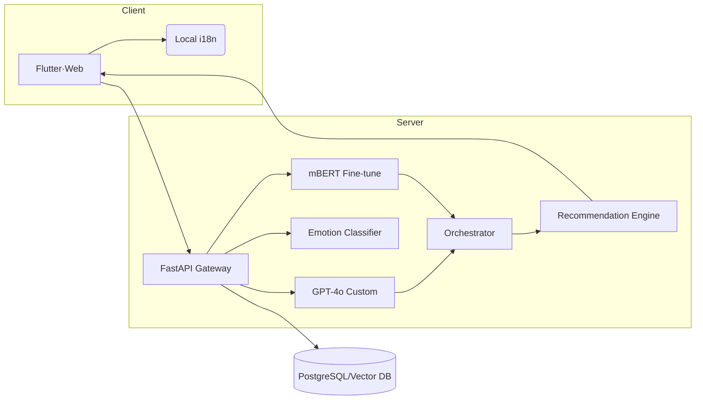

---
up:
  - "[[CNU 생성형 AI 챌린지]]"
related: 
created: 2025-07-31
---
**UniBuddy 서비스 기능 정의 보고서**

_(v1.0 — 2025-07-31,_ 작성_: UX·AI Product_오사카사절단_)_

  

## **1. 문제 정의 (Problem Statement)**

|   |   |   |
|---|---|---|
|**Pain Point**|**구체적** **상황**|**확인된** **인사이트**|
|**정서적** **불안**|유학생 47 % 수면장애·40 % 불안·49 % 우울 경험|학업 집중도·유지율 저하, 중도탈락 위험 증가|
|**언어****·****문화** **장벽**|TOPIK 요건, 교수-학생 이메일·발표 시 문화적 표현 차이|강의 이해도·평가 격차, 오해·부정적 피드백 야기|
|**사회적** **고립**|내국인 네트워킹 빈약, 지역 정보 부족|소속감·생활 만족도 저하, 정서 문제 심화|
|**정보** **단편화**|학습 자료·생활 꿀팁·지원 제도 흩어져 있음|필요 정보 탐색 시간 ↑, 도움 요청 포기 사례|
|**대학** **대응** **한계**|상담 인력·예산 제약, 실시간 케어 부족|문제 인지 → 개입까지 지연, ‘사각지대’ 발생|

## **2. 서비스 목표 (Service Objectives)**

1. **정서 안정** : AI-기반 감정 파악 & 즉각적 공감·리소스 연결
2. **학습 이해도 향상** : 강의·과제 자료를 유학생 눈높이로 재구성
3. **문화 / 커뮤니케이션 격차 해소** : 교수 · 학생 간 자연스러운 소통 지원
4. **사회적 연결 촉진** : 내·외국인 학생 P2P 정보·경험 교류 활성화
5. **데이터 기반 지원 체계 구축** : 상담센터·국제교류본부와 연동, 조기 개입

  

## **3. 핵심 기능 정의 (Key Features)**

|   |   |   |   |
|---|---|---|---|
|**#**|**기능명**|**상세** **설명**|**대표** **사용** **시나리오**|
|**F1**|**AI** **강의** **리포맷터** **(Lecture Reformatter)**|• 강의 PPT·노트·녹음 업로드 → GPT 요약+용어 해설• 배경 지식 카드·퀴즈 자동 생성• 한국어·영어·모국어(중·베·인니 등) 동시 지원|*린(중국)*이 전공 PPT를 업로드 → ‘쉬운 영어+용어 사전+핵심 퀴즈’ 패킷 수신 → 시험 전 복습|
|**F2**|**마음의** **통역사** **(Emotion & Culture Chatbot)**|• 대화 중 감정 스코어링·문화 맥락 감지 (mBERT+감정 BERT)• “공감 답변 → 상황 분석 → 대응 전략·교내 자원 추천” 3-Step 플로우|아디티야_(_인도네시아_)_: “오늘 교수님이 나를 무시한 것 같아” → 챗봇이 문화적 표현 차이·상담센터 정보 안내|
|**F3**|**교수** **소통** **헬퍼** **(Prof-Connect)**|• 이메일·질문·발표 스크립트 템플릿 생성• 직설적 표현 → 완곡·정중한 한국 학술 표현으로 변환• 발송 전 톤·형식 점검 체크리스트|*마리아(스페인)*가 마감 연장 요청 초안 입력 → “적절한 존칭+배경 설명” 버전으로 재작성|
|**F4**|**유학생** **커뮤니티** **(Global Commons)**|• 캠퍼스·대전 생활 Q&A, 맛집·행사·알바 정보 게시판• 태그·지역 맵핑, 자동 번역·요약 제공• 내국인 멘토 그룹, 관심사 기반 추천 알고리즘|*준호(한국)*이 “중도 포차 축제” 게시 → 영어·중국어 자동 요약, 현지 음식 문화 설명 포함|
|**F5**|**AI-****커뮤니티** **연계** **(Sentiment-Match Engine)**|• F2 감정 결과와 커뮤니티 활동 데이터 연결• 스트레스 지표 ↑ 시 ‘힐링 게시판’·멘토링 세션 추천• 챗봇 요약 답변을 게시글로 전환 제안 (지식 축적)|챗봇이 *사라(미국)*의 ‘집값 스트레스’ 감지 → ‘대전 저가 원룸 팁’ 게시판·멘토 메시지 추천|

## **4. 기술 구성 (Tech Stack Overview)**

- **모델** : GPT-4o (리포맷·소통), mBERT (다국어 이해), KoELECTRA-Emotion (감정)
- **데이터 흐름** : 업로드 → STT → 벡터 저장 → 요약·추천 → 실시간 피드백
- **인프라** : 컨테이너(K8s) + GPU Inference API / 모바일 Edge Caching
- **보안·프라이버시** : 학습 데이터 익명화, EU-GDPR·PIPA 준수, SSO (CNU Portal)

  

## **5. 기존 서비스 대비 차별성 (Differentiation)**

|                |                      |                                   |
| -------------- | -------------------- | --------------------------------- |
| **구분**         | **기존** **솔루션**       | **UniBuddy** **혁신** **포인트**       |
| **정서** **케어**  | 주 1회 오프라인 상담, 언어별 한정 | 24/7 감정 분석·공감 챗봇 + 실시간 리소스 연결     |
| **학습** **보조**  | 일반 번역·자막 제공          | ‘인지심리 + 문화’ 기반 재구성, 용어사전·퀴즈까지 패키징 |
| **커뮤니케이션**     | 이메일 샘플 배포            | AI가 상황·톤·문화 맥락 반영해 자동 작성·교정       |
| **커뮤니티**       | 페이스북·카톡 자발적 그룹       | AI 매칭·자동 번역·감정 연동으로 참여 허들↓·정보 품질↑ |
| **데이터** **활용** | 분절형 시스템(상담, 학사, 게시판) | 대화·학습·정서 로그 통합 대시보드 → 조기 개입·정책 지원 |

## **6. 기대 효과 (Expected Impact)**

|   |   |   |
|---|---|---|
|**이해관계자**|**정량****·****정성** **효과**|**측정** **지표****(KPI)**|
|**유학생**|• 학업 이해도 +20 %• 우울·불안 점수 -15 %• 한국인 친구 수 +30 %|• 사전·사후 시험• PHQ-9 / GAD-7• 소셜 네트워크 분석|
|**교수자**|• 이메일 처리 시간 -40 %• 강의 만족도 +0.4점|• 응답 지연 평균• 수업 평가 점수|
|**대학****(****충남대****)**|• 유학생 유지율 +8 %p• 국제 QS 지표 ‘International Student’ 세부 점수 향상|• 등록 유지율 통계• QS·THE 랭킹 변화|
|**지역사회****(****대전****)**|• 외국인 소비·문화 교류 이벤트 참여자 수 증가|• 지역 행사·소비 분석|

**미션 핏** : 저출산·학령인구 감소 시대에 ‘글로벌 친화 캠퍼스’로 전환, 경쟁 대학 대비 브랜드 우위 선점.

  

**부록 : 3-Step 로드맵 (요약)**

1. **Beta (’25 Q3)** : F1·F2 MVP, 국제교류본부 100명 파일럿
2. **Launch (’25 Q4)** : F3·F4 연동, 커뮤니티 1,000명 확장
3. **Scale (’26)** : F5 통합, 대학·지역 공공기관 파트너십 확대

  