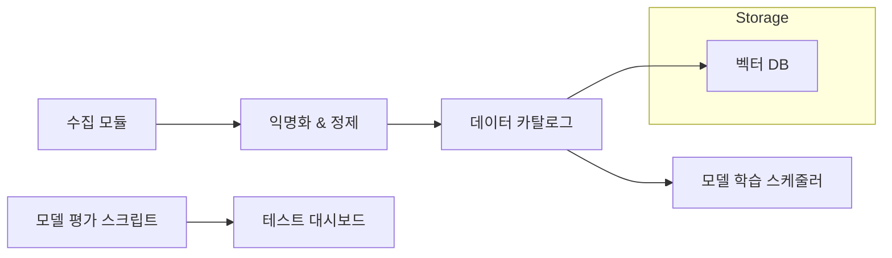

---
up:
  - "[[CNU 생성형 AI 챌린지]]"
related: 
created: 2025-07-31
---
## 한눈에 보는 핵심 요약

UniBuddy MVP를 학습·검증하려면 **① 내부 실사용 데이터(강의·대화·커뮤니티), ② 공개 감정·다국어·음성·이메일 코퍼스, ③ 1차 조사·크라우드소싱**의 3트랙을 병행해, 모델별로 **텍스트 8종·음성 5종·다언어 4종·상호작용 로그 3종**을 확보합니다. 각 원천은 라이선스·개인정보 검수 후 **▶ 수집 ▶ 정제 ▶ 익명화 ▶ 벡터DB 등록** 파이프라인으로 통합됩니다.

---

## 1. 데이터 요구 매핑

| 기능                     | 필요 데이터 유형            | 외부 공개 코퍼스                                                                                                                                                                                | 내부·1차 수집 항목                    |
| ---------------------- | -------------------- | ---------------------------------------------------------------------------------------------------------------------------------------------------------------------------------------- | ------------------------------ |
| **F1 강의 리포맷터**         | 강의 음성·PPT·녹취·자막      | 한국어 강의 음성 Dataset (AI-Hub) ([aihub.or.kr][1]), 대학강의 ASR 코퍼스 ([aihub.or.kr][2]), TED Talk 병렬 자막 ([Kaggle][3])                                                                             | CNU LMS 자료·녹화, 교수자 제공 PPT      |
| **F2 감정·문화 챗봇**        | 감정 라벨 문장·음성, 상담 대화   | AI-Hub 감정 음성 ([aihub.or.kr][4]), KEMDy20 멀티모달 ([nanum.etri.re.kr][5]), KEmoFact 텍스트 ([Nature][6]), OLKAVS AV Speech ([arXiv][7]), KETI Emotion 데이터 ([GitHub][8]), KMI 상담 대화 ([arXiv][9]) | CNU 상담센터 익명 로그, 유학생 인터뷰(30명)   |
| **F3 교수 소통 헬퍼**        | 이메일·질문 예시·피드백        | Enron Email Corpus ([CMU School of Computer Science][10]), 오픈 한국어 코퍼스(전자우편 포함) ([GitHub][11])                                                                                            | CNU 교수-학생 이메일(익명화)·피드백 주석      |
| **F4 커뮤니티**            | Q\&A 게시글·생활 팁·지역 데이터 | 국·영 병렬 말뭉치 ([aihub.or.kr][12]), Korean-English parallel corpora ([GitHub][13])                                                                                                           | 에브리타임·학과 단톡(동의 후), 대전 생활정보 크롤링 |
| **F5 Sentiment-Match** | 감정 스코어↔커뮤니티 활동 로그    | 위 F2 감정 결과 + 커뮤니티 데이터                                                                                                                                                                    | 실서비스 베타 로그(100 명, 4주)          |

---

## 2. 수집 전략 & 절차

### 2-1. 외부 공개 데이터 인입

1. **라이선스 확인 → 다운로드 → Checksum 관리**
2. 원본 보존 / 전처리본 분리 저장 (S3 + DVC).
3. JSONL 통일 스키마로 변환 → 벡터DB(Chroma) 등록.

### 2-2. 내부 데이터 협력

| 기관          | 데이터              | 협조 절차                        |
| ----------- | ---------------- | ---------------------------- |
| **국제교류본부**  | 유학생 설문, TOPIK 레벨 | MOU·IRB 승인 후 SFTP 수신         |
| **LMS 운영팀** | 강의 자료·녹화         | 교수 동의 체크리스트 발송 → 자동 스크래핑 배치  |
| **상담센터**    | 익명 상담 대화         | 민감 정보 마스킹 스크립트 적용 후 주차별 Dump |

### 2-3. 1차 크라우드소싱

* **이메일·발표 스크립트 변환**: GPT 생성 초안 → 유학생·조교 200명 리뷰 태스크.
* **문화 맥락 주석**: “직설→완곡”·“존댓말” 등 15개 태그 가이드 작성.

### 2-4. 윤리·법규 체크

* 개인정보 Pseudonymization 지침(PIPA) 적용.
* 국외 반출 여부 검토 — 미국 서버>원본 금지, 임베딩만 전송.
* IRB 번호·동의서 클라우드 문서화.

---

## 3. 파이프라인 아키텍처

* **정제**: 언어 감지 → 중복 제거 → 토큰 길이 Trim
* **평가**: 20 % 검증 세트 잠금, K-fold 블라인드 리뷰.

---

## 4. 일정·자원 계획

| 월   | 주요 마일스톤            | 담당       | 산출물               |
| --- | ------------------ | -------- | ----------------- |
| 8월  | 외부 코퍼스 수집 완료       | Data Ops | 원본 1.2 TB 보관      |
| 9월  | 내부 로그·설문 수집        | 제품팀      | CSV + 오디오 200h    |
| 10월 | 어노테이션·주석 (8주)      | Crowd 팀  | 이메일 5k, 문화 태그 30k |
| 11월 | MVP 모델 학습·오프라인 평가  | ML 팀     | BLEU·CER·F1 리포트   |
| 12월 | 온라인 A/B 테스트 (100명) | UX 팀     | 만족도·정서 지표 변화      |

---

## 5. 기대 리스크 & 대응

| 리스크           | 대응 방안                       |
| ------------- | --------------------------- |
| 민감 정보 유출      | Regex+NER 마스킹, 멀티-레이어 검수    |
| 데이터 편향(국적·성별) | 샘플 비율 체크 자동 경고, 언더샘플링       |
| 라이선스 충돌       | SPDX 메타 태그 관리, 3단계 재검토 워크플로 |
| 어노테이터 일관성     | 20 문장 단위 골드 세트 ±κ 0.8 이상 유지 |

---

**결론**
본 계획은 ‘강의→정서→커뮤니티’ 전 과정을 아우르는 **다양·대용량·고품질 코퍼스** 확보 로드맵입니다. 데이터 거버넌스·윤리 체계를 함께 설계해, UniBuddy의 학습·테스트·실서비스 전환까지 **6개월 내 실행 가능한** 현실적 근거를 제공합니다.

[1]: https://aihub.or.kr/aihubdata/data/view.do?dataSetSn=115&utm_source=chatgpt.com "한국어 강의 음성 - AI-Hub"
[2]: https://aihub.or.kr/aihubdata/data/view.do?dataSetSn=71627&utm_source=chatgpt.com "한국어 대학 강의 데이터 - AI-Hub"
[3]: https://www.kaggle.com/datasets/miguelcorraljr/ted-ultimate-dataset?utm_source=chatgpt.com "TED Talks Transcripts for NLP - Kaggle"
[4]: https://aihub.or.kr/aihubdata/data/view.do?dataSetSn=263&utm_source=chatgpt.com "감정 분류를 위한 대화 음성 데이터셋 - AI-Hub"
[5]: https://nanum.etri.re.kr/share/kjnoh2/KEMDy20?lang=En_us&utm_source=chatgpt.com "Korean Emotion Multimodal Database in 2020 (KEMDy20)"
[6]: https://www.nature.com/articles/s41598-023-45386-8?utm_source=chatgpt.com "A Korean emotion-factor dataset for extracting emotion and ... - Nature"
[7]: https://arxiv.org/abs/2301.06375?utm_source=chatgpt.com "OLKAVS: An Open Large-Scale Korean Audio-Visual Speech Dataset"
[8]: https://github.com/treblenalto/korean-speech-emotion-recognition?utm_source=chatgpt.com "treblenalto/korean-speech-emotion-recognition: 한국어 STT를 통한 ..."
[9]: https://arxiv.org/abs/2502.05651?utm_source=chatgpt.com "KMI: A Dataset of Korean Motivational Interviewing Dialogues for Psychotherapy"
[10]: https://www.cs.cmu.edu/~enron/?utm_source=chatgpt.com "Enron Email Dataset"
[11]: https://github.com/ko-nlp/Open-korean-corpora?utm_source=chatgpt.com "GitHub - ko-nlp/Open-korean-corpora"
[12]: https://aihub.or.kr/aihubdata/data/view.do?dataSetSn=71498&utm_source=chatgpt.com "한국어-다국어 번역 말뭉치 (인문학) - AI-Hub"
[13]: https://github.com/jungyeul/korean-parallel-corpora?utm_source=chatgpt.com "jungyeul/korean-parallel-corpora - GitHub"
